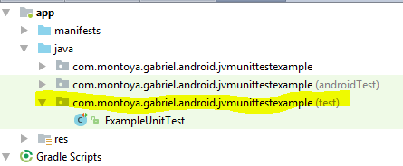

# JVM unit Test

The intention of this project is to show how to implement a **local** JVM unit test.


## Set Up the Testing Environment

In your Android Studio project, you must store the source files for local unit tests at ```module-name/src/test/java/```. This directory already exists when you create a new project.
in the current example is on ``` \JVMUnitTestExample\app\src\test\java\com\montoya\gabriel\android\jvmunittestexample```




You also need to configure the testing dependencies for your project to use the standard APIs provided by the JUnit 4 framework.  

```gradle  
    dependencies {
        // Required -- JUnit 4 framework
        testCompile 'junit:junit:4.12'
   
    }
```


## References
[Building Local Unit Test](https://developer.android.com/training/testing/unit-testing/local-unit-tests.html)
